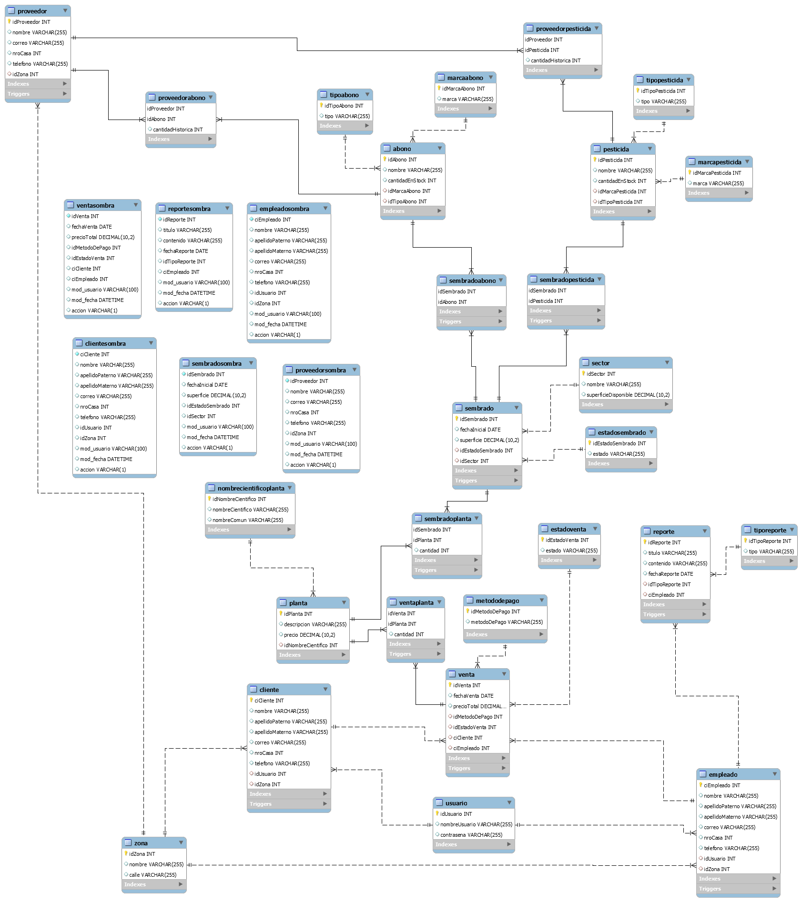

# Segundo Proyecto Bases de Datos Avanzadas - Programación SQL - Base de Datos para el Vivero Municipal.

## Autor 👤:
-  **Nombre:** Marcos Andrés Simon Ágreda
-  **Código:** 56728
- **Semestre:** I-2023
- **Carrera:** Ingeniería de Sistemas Computacionales

## Descripción de la entidad y los requisitos 📝:

El presente proyecto, perteneciente al segundo parcial del curso de Base de Datos Avanzadas de las Universidad Privada Boliviana, está centrado en la creación, mediante conceptos avanzados del lenguaje SQL, vistos en la antes mencionada materia, de una Base de Datos, la cual, tiene el objetivo de almacenar información relevante sobre la los procesos productivos del Vivero Municipal de la ciudad de Cochabamba, especificador por la empresa pública EMAVRA (Empresa Municipal de Áreas Verdes y Recreación Alternativa). El presente proyecto está fuertemente basado en la implementación de tres conceptos avanzados de MySQL, cuya implementación es realizada para mejorar y por sobre todo, optimizar dicha base de datos; estos conceptos son: **Índices, Triggers y Stored Procedures.**.


Dicho proyecto, con nombre: "Desarrollo De Software, Para Sistema De Información De Almacenes Y Gestión De Procesos Productivos De La Unidad De Viveros De Emavra", fue extraído de la página: [SICOES](https://www.sicoes.gob.bo/portal/index.php) (Sistema de contrataciones estatales), de dónde, su CUCE (Código Único de Contrataciones Estatales) es: **21-2303-00-1165439-1-1**. Dicha entidad, como su nombre lo indica, tiene como objetivo primordial, el desarrollo de un programa informático tipo software, mediante el cual, se maneje el control de inventarios de los almacenes de la unidad de viveros de la EMAVRA, para que de ésta manera, todos los procesos productivos que sean llevados a cabo en el Vivero Municipal de la EMAVRA, ubicado en la ciudad de Cochabamba, sean registrados y controlados de manera eficiente y eficaz.

De manera más específica, la orden de contratación de dicha entidad, brinda una serie de requisitos, los cuales se detallan a continuación:

- Módulo de Gestión de Procesos: El presente módulo, tal y como se encuentra detallado en la oferta del proveedor, solicita el registro de tanto: Sembrados, como abonos en el sistema.

- Módulo Venta de plantas: El presente módulo, solicita la posibilidad de la realización del registro y la eliminación de ventas de plantas (siendo las plantas, las que se encuentran disponibles en el propio Vivero Municipal).

- Módulo Proveedores de Insumo: El presente módulo, solicita la posibilidad de la realización del registro, modificación y eliminación de proveedores de insumos, junto a dichos insumos, además de la información relevante del propio proveedor de insumos.

- Módulo Mantención de Empleado: El presente módulo, solicita la posibilidad de la realización del registro y eliminación de empleados, junto a la información relevante del propio empleado.

- Módulo de Reportes: El presente módulo, solicita la posibilidad del registro de reportes ya existentes de diversos tipos: Como ser, reposrtes de producción, ventas, clientes, productos, categorías o inventarios.

- Módulo Reserva de Plantas: El presente módulo, solicita la posibilidad de la realización del registro y eliminación de las diversas plantas que se encuentran en virtud de ser reservadas por cliente, junto a la información relevante de la propia planta, siendo lo más importante, su stock.

- Módulo Mantención de Usuarios: El presente módulo solicita la posibilidad de la realización del registro, modificación y eliminación de usuarios, junto a la información relevante del propio usuario.

- Módulo Mantención de Clientes: El presente módulo solicita la posibilidad de la realización del registro, modificación y eliminación de clientes, junto a la información relevante del propio cliente.

- Módulo Gestión de Depóstio: El presente módulo, solicita la posibilidad de la realización del registro, modificación y eliminación de tanto los proveedores, como de los insumos que se mencionaron anteriormente, además de poder verificar la información relavente sobre los propios insumos.


Debido a que el presente proyecto, se limita al desarrollo de una arquitectura de base de datos; se realizaron pequeñas modificaciones en el proyecto de la EMAVRA, las cuales, fueron destinadas a limitar el Alcance del proyecto, a algo que pueda ser cumplido, simplemente realizando un esquema e implementación de bases de datos. En este caso, los cambios realizados fueron:

- Debido a la ambigüedad que trae el Módulo de Gestión de Procesos, se decidió dividir dicho módulo, en dos separados, los cuales son: Módulo de Sembrados y Módulo de Abonos.

- Debido a que el documento de contratación, no especifica de manera completa, cuales son los Insumos que manejan los Proveedores, se redujo a solamente un insumo, el ya mencionado Abono.

- Debido a que el módulo de reserva de Plantas, es demasiado ambigüo, en relación a lo que se debe almacenar en el sistema, se decidió que dicho módulo, simplemente guardaría información relevante sobre las plantas que se encuentran en el Vivero Municipal.

- Por último, debido a que el módulo de Gestión de Depósitos solamente trata el registro de Proveedores e Insumos (casos que ya se trataron en los módulos de Proveedores e Insumos de manera individual), se decidió eliminar dicho módulo.

Por lo tanto, ya con el alcance de los módulos bien definido, cada uno de éstos módulos, se decidió que sería representado por una Tabla en la Base de Datos, de tal manera, que la organización de dicha Base de Datos terminaría de la siguiente manera:

- sembrado:
    - idSembrado (PK)
    - cantidad
    - fechaInicial
    - estado

- abono:
    - idAbono (PK)
    - nombre
    - marca
    - tipo
    - cantidadEnStock
    - idProveedor (FK)

- venta:
    - idVenta (PK)
    - cantidadVendida
    - fechaVenta
    - ciCliente (FK)
    - ciEmpleado (FK)

- proveedor:
    - idProveedor (PK)
    - nombre
    - correo
    - direccion
    - telefono

- reporte:
    - idReporte (PK)
    - titulo
    - contenido
    - fechaReporte
    - tipo
    - ciEmpleado (FK)

- empleado:
    - ciEmpleado (PK)
    - nombre
    - apellido
    - correo
    - direccion
    - telefono
    - idUsuario (FK)

- planta
    - idPlanta (PK)
    - nombreComun
    - nombreCientifico
    - descripcion
    - precio

- usuario:
    - idUsuario (PK)
    - nombreUsuario
    - contrasena

- cliente:
    - ciCliente (PK)
    - nombre
    - apellido
    - correo
    - direccion
    - telefono
    - idUsuario (FK)    

Sin embargo, debido al objetivo del presente proyecto, que se basa principalmente en la mejora y optimización continua de las bases de datos, la base de datos anteriormente mencionada,  fue sometida a un proceso conocido como "Normalización", el cual, se encarga de eliminar la redundancia de datos, y de esta manera, mejorar la eficiencia de la base de datos. Dicha normalización, fue llevada hasta la conocida  **5ta Forma Normal**, la cual, consiste en principalmente, separar valores repetidos/redudantes o anómalos, en tablas separadas, las cuales, se relacionan con la tabla original, mediante una relación. De esta manera, la base de datos, terminó de la siguiente manera:

- sembrado:
  - idSembrado (PK)
  - fechaInicial
  - superficie
  - idEstadoSembrado (FK)
  - idSector (FK)

- estadosembrado:
  - idEstadoSembrado (PK)
  - estado

- abono:
  - idAbono (PK)
  - nombre
  - cantidadEnStock
  - idMarcaAbono (FK)
  - idTipoAbono (FK)

 - marcaabono:
   - idMarcaAbono (PK)
   - marca

- tipoabono:
    - idTipoAbono (PK)
    - tipo

- venta:
    - idVenta (PK)
    - fechaVenta
    - precioTotal
    - idMetodoDePago (FK)
    - idEstadoVenta (FK)
    - ciCliente (FK)
    - ciEmpleado (FK)

- metododepago:
    - idMetodoDePago (PK)
    - metodoDePago

- estadoventa:
    - idEstadoVenta (PK)
    - estado

- proveedor:
    - idProveedor (PK)
    - nombre
    - correo
    - nroCasa
    - telefono
    - idZona (FK)

- zona:
    - idZona (PK)
    - nombre
    - calle

- reporte:
    - idReporte (PK)
    - titulo
    - contenido
    - fechaReporte
    - idTipoReporte (FK)
    - ciEmpleado (FK)

- tiporeporte:
    - idTipoReporte (PK)
    - tipo

- empleado:
    - ciEmpleado (PK)
    - nombre
    - apellidoPaterno
    - apellidoMaterno
    - correo
    - nroCasa
    - telefono
    - idUsuario (FK)
    - idZona (FK)

- planta:
    - idPlanta (PK)
    - descripcion
    - precio
    - idNombreCientifico (FK)

- nombrecientificoplanta:
    - idNombreCientifico (PK)
    - nombreCientifico
    - nombreComun

- usuario:
    - idUsuario (PK)
    - nombreUsuario
    - contrasena

- cliente:
    - ciCliente (PK)
    - nombre
    - apellidoPaterno
    - apellidoMaterno
    - correo
    - nroCasa
    - telefono
    - idUsuario (FK)
    - idZona (FK)

- pesticida
    - idPesticida (PK)
    - nombre
    - cantidadEnStock
    - idMarcaPesticida (FK)
    - idTipoPesticida (FK)

- marcapesticida:
    - idMarcaPesticida(PK)
    - marca

- tipopesticida:
    - idTipoPesticida(PK)
    - tipo

- sector:
    - idSector (PK)
    - nombre
    - superficieDisponible

- sembradoabono:
    - idSembrado (PK, FK)
    - idAbono (PK, FK)

- sembradoplanta:
    - idSembrado (PK, FK)
    - idPlanta (PK, FK)
    - cantidad

- ventaplanta:
    - idVenta (PK, FK)
    - idPlanta (PK, FK)
    - cantidad

- proveedorabono:
   - idProveedor(PK,FK)
   - idAbono(PK,FK)
   - cantidadHistorica


- proveedorpesticida
    - idProveedor(PK,FK)
    - idPesticida(PK,FK)
    - cantidadHistorica

- sembradopesticida:
    - idSembrado(PK,FK)
    - idPesticida(PK,FK)


## Diagrama propuesto de Base de Datos 📁




## Stored Procedures 🏬

Para el presente proyecto, se crearon un total de 12 Stored Procedures, los cuales, se encargan de realizar las operaciones más importantes de la base de datos, y de esta manera, poder lograr la reutilización de código, y la optimización de la base de datos. A continuación, se presentan los Stored Procedures creados:

- CrearSembrado:
```sql
DELIMITER //
CREATE PROCEDURE CrearSembrado (
  IN p_fechaInicial DATE,
  IN p_superficie INT,
  IN p_idEstadoSembrado INT,
  IN p_idSector INT,
  IN p_plantas JSON
)
BEGIN

  DECLARE i INT DEFAULT 0;
  DECLARE plantas_count INT;
  DECLARE planta_id INT;
  DECLARE planta_cantidad INT;

  INSERT INTO sembrado (fechaInicial,superficie,idEstadoSembrado, idSector)
  VALUES (p_fechaInicial,p_superficie,p_idEstadoSembrado, p_idSector);

  SET @sembrado_id = LAST_INSERT_ID();

  SET plantas_count = JSON_LENGTH(p_plantas);

  WHILE i < plantas_count DO

    SET planta_id = JSON_EXTRACT(p_plantas, CONCAT('$[', i, '].idPlanta'));
    SET planta_cantidad = JSON_EXTRACT(p_plantas, CONCAT('$[', i, '].cantidad'));

    INSERT INTO sembradoplanta (idSembrado, idPlanta, cantidad)
    VALUES (@sembrado_id, planta_id, planta_cantidad);

    SET i = i + 1;
  END WHILE;
END //

DELIMITER ;
```

Este Stored Procedure, se encarga de crear un nuevo sembrado, y de esta manera, poder registrar las plantas que se sembraron en dicho sembrado. Para ello, se recibe como parámetro, la fecha inicial del sembrado, la superficie del sembrado, el id del estado del sembrado, el id del sector en el cual se sembró, y un JSON, el cual, contiene la información de las plantas que se sembraron en dicho sembrado. Para ello, se recorre el JSON, y se van insertando las plantas en la tabla sembradoplanta, la cual, contiene el id del sembrado, el id de la planta, y la cantidad de plantas que se sembraron.

- ActualizarSembradoPlanta:
```sql

DELIMITER //

CREATE PROCEDURE ActualizarSembradoPlanta (
  IN p_idSembrado INT,
  IN p_plantas JSON,
  IN p_plantas_eliminar JSON
)
BEGIN

  DECLARE i INT DEFAULT 0;
  DECLARE plantas_count INT;
  DECLARE planta_id INT;
  DECLARE planta_cantidad INT;

  IF p_plantas IS NOT NULL THEN

  SET plantas_count = JSON_LENGTH(p_plantas);

  WHILE i < plantas_count DO

    SET planta_id = JSON_EXTRACT(p_plantas, CONCAT('$[', i, '].idPlanta'));
    SET planta_cantidad = JSON_EXTRACT(p_plantas, CONCAT('$[', i, '].cantidad'));

    IF EXISTS (
      SELECT * FROM sembradoplanta WHERE idSembrado = p_idSembrado AND idPlanta = planta_id
    ) THEN
      UPDATE sembradoplanta SET cantidad = cantidad + planta_cantidad WHERE idSembrado = p_idSembrado AND idPlanta = planta_id;
    ELSE
      INSERT INTO sembradoplanta (idSembrado, idPlanta, cantidad) VALUES (p_idSembrado, planta_id, planta_cantidad);
    END IF;

    SET i = i + 1;
  END WHILE;
  END IF;

  IF p_plantas_eliminar IS NOT NULL THEN

  SET plantas_count = JSON_LENGTH(p_plantas_eliminar);
  SET i = 0;

  WHILE i < plantas_count DO

    SET planta_id = JSON_EXTRACT(p_plantas_eliminar, CONCAT('$[', i, '].idPlanta'));

    DELETE FROM sembradoplanta WHERE idSembrado = p_idSembrado AND idPlanta = planta_id;
    SET i = i + 1;
  END WHILE;

  END IF;

END //

DELIMITER ;

```

Este Stored Procedure, se encarga de actualizar las plantas que se sembraron en un sembrado. Para ello, se recibe como parámetro, el id del sembrado, un JSON, el cual, contiene la información de las plantas que se sembraron en dicho sembrado, y otro JSON, el cual, contiene la información de las plantas que se eliminaron del sembrado. Para ello, se recorre el JSON de las plantas a insertar, y se van insertando las plantas en la tabla sembradoplanta, la cual, contiene el id del sembrado, el id de la planta, y la cantidad de plantas que se sembraron. Por otro lado, se recorre el JSON de las plantas a eliminar, y se van eliminando las plantas de la tabla sembradoplanta.

- EliminarSembrado:
```sql
DELIMITER //

CREATE PROCEDURE EliminarSembrado (
  IN p_idSembrado INT
)
BEGIN

  DELETE FROM sembradoplanta WHERE idSembrado = p_idSembrado;

  DELETE FROM sembradopesticida WHERE idSembrado = p_idSembrado;

  DELETE FROM sembradoabono WHERE idSembrado = p_idSembrado;

  DELETE FROM sembrado WHERE idSembrado = p_idSembrado;

END //

DELIMITER ;
```

Este Stored Procedure, se encarga de eliminar un sembrado. Para ello, se recibe como parámetro, el id del sembrado. Para ello, se eliminan los registros de la tabla sembradoplanta, sembradopesticida, sembradoabono, y sembrado, los cuales, contienen el id del sembrado.

- CrearVenta:
```sql
DELIMITER //

CREATE PROCEDURE CrearVenta (
  IN p_fechaVenta DATE,
  IN p_idMetodoDePago INT,
  IN p_idEstadoVenta INT,
  IN p_ciCliente INT,
  IN p_ciEmpleado INT,
  IN p_plantas JSON
)
BEGIN

  DECLARE i INT DEFAULT 0;
  DECLARE plantas_count INT;
  DECLARE planta_id INT;
  DECLARE planta_cantidad INT;

  INSERT INTO venta (fechaVenta,precioTotal ,idMetodoDePago, idEstadoVenta, ciCliente, ciEmpleado)
  VALUES (p_fechaVenta,0.0,p_idMetodoDePago, p_idEstadoVenta, p_ciCliente, p_ciEmpleado);

  SET @venta_id = LAST_INSERT_ID();


  SET plantas_count = JSON_LENGTH(p_plantas);


  WHILE i < plantas_count DO

    SET planta_id = JSON_EXTRACT(p_plantas, CONCAT('$[', i, '].idPlanta'));
    SET planta_cantidad = JSON_EXTRACT(p_plantas, CONCAT('$[', i, '].cantidad'));


    INSERT INTO ventaplanta (idVenta, idPlanta, cantidad)
    VALUES (@venta_id, planta_id, planta_cantidad);

    SET i = i + 1;
  END WHILE;
END //

DELIMITER ;
```

Este Stored Procedure, se encarga de crear una nueva venta, y de esta manera, poder registrar las plantas que se vendieron en dicha venta. Para ello, se recibe como parámetro, la fecha de la venta, el id del método de pago, el id del estado de la venta, el ci del cliente, el ci del empleado, y un JSON, el cual, contiene la información de las plantas que se vendieron en dicha venta. Para ello, se recorre el JSON, y se van insertando las plantas en la tabla ventaplanta, la cual, contiene el id de la venta, el id de la planta, y la cantidad de plantas que se vendieron.

- ActualizarVentaPlanta:
```sql

DELIMITER //

CREATE PROCEDURE ActualizarVentaPlanta (
  IN p_idVenta INT,
  IN p_plantas JSON,
  IN p_plantas_eliminar JSON
)
BEGIN
  DECLARE plantas_count INT;
  DECLARE i INT DEFAULT 0;
  DECLARE planta_id INT;
  DECLARE planta_cantidad INT;

  IF p_plantas IS NOT NULL THEN

  SET plantas_count = JSON_LENGTH(p_plantas);

  WHILE i < plantas_count DO


    SET planta_id = JSON_EXTRACT(p_plantas, CONCAT('$[', i, '].idPlanta'));
    SET planta_cantidad = JSON_EXTRACT(p_plantas, CONCAT('$[', i, '].cantidad'));

    IF EXISTS (
      SELECT * FROM ventaplanta WHERE idVenta = p_idVenta AND idPlanta = planta_id
    ) THEN
      UPDATE ventaplanta SET cantidad = cantidad + planta_cantidad WHERE idVenta = p_idVenta AND idPlanta = planta_id;
    ELSE

    INSERT INTO ventaplanta (idVenta, idPlanta, cantidad)
    VALUES (p_idVenta, planta_id, planta_cantidad);
    END IF;
    SET i = i + 1;

  END WHILE;
  END IF;

  IF p_plantas_eliminar IS NOT NULL THEN
      SET plantas_count = JSON_LENGTH(p_plantas_eliminar);
      SET i = 0;

  WHILE i < plantas_count DO

    SET planta_id = JSON_EXTRACT(p_plantas_eliminar, CONCAT('$[', i, '].idPlanta'));
    DELETE FROM ventaplanta WHERE idVenta = p_idVenta AND idPlanta = planta_id;
    SET i = i + 1;
  END WHILE;
  END IF;

END //

DELIMITER ;

```

Este Stored Procedure, se encarga de actualizar las plantas que se vendieron en una venta. Para ello, se recibe como parámetro, el id de la venta, un JSON, el cual, contiene la información de las plantas que se vendieron en dicha venta, y otro JSON, el cual, contiene la información de las plantas que se eliminaron de la venta. Para ello, se recorre el JSON de las plantas a insertar, y se van insertando las plantas en la tabla ventaplanta, la cual, contiene el id de la venta, el id de la planta, y la cantidad de plantas que se vendieron. Por otro lado, se recorre el JSON de las plantas a eliminar, y se van eliminando las plantas de la tabla ventaplanta.

- EliminarVenta:
```sql
DELIMITER //

CREATE PROCEDURE EliminarVenta(
  IN p_idVenta INT
)
BEGIN

  DELETE FROM ventaplanta WHERE idVenta = p_idVenta;

  DELETE FROM venta WHERE idVenta = p_idVenta;


END //
DELIMITER ;
```

Este Stored Procedure, se encarga de eliminar una venta. Para ello, se recibe como parámetro, el id de la venta. Para ello, se eliminan los registros de la tabla ventaplanta, y venta, los cuales, contienen el id de la venta.

- CrearProveedor:
```sql
DELIMITER //

CREATE PROCEDURE CrearProveedor (
  IN p_nombre VARCHAR(100),
  IN p_correo VARCHAR(100),
  IN p_nroCasa INT,
  IN p_telefono VARCHAR(20),
  IN p_idZona INT,
  IN p_abonos JSON,
  IN p_pesticidas JSON
)
BEGIN
  DECLARE proveedor_id INT;
  DECLARE i INT DEFAULT 0;
  DECLARE abonos_count INT;
  DECLARE abono_nombre VARCHAR(200);
  DECLARE abono_cantidad INT;
  DECLARE abono_marca VARCHAR(200);
  DECLARE abono_tipo INT;
  DECLARE abono_id INT;
  DECLARE marca_id INT;
  DECLARE pesticidas_count INT;
  DECLARE pesticida_nombre VARCHAR(200);
  DECLARE pesticida_cantidad INT;
  DECLARE pesticida_marca VARCHAR(200);
  DECLARE pesticida_tipo INT;
  DECLARE pesticida_id INT;

  INSERT INTO proveedor (nombre, correo,nroCasa ,telefono,idZona )
  VALUES (p_nombre,p_correo,p_nroCasa, p_telefono, p_idZona);

  SET proveedor_id = LAST_INSERT_ID();

  IF p_abonos IS NOT NULL THEN

      SET abonos_count = JSON_LENGTH(p_abonos);

  WHILE i < abonos_count DO
    SET abono_nombre = JSON_UNQUOTE(JSON_EXTRACT(p_abonos, CONCAT('$[', i, '].nombre')));
    SET abono_cantidad = JSON_EXTRACT(p_abonos, CONCAT('$[', i, '].cantidad'));
    SET abono_marca = JSON_UNQUOTE(JSON_EXTRACT(p_abonos, CONCAT('$[', i, '].marca')));
    SET abono_tipo = JSON_EXTRACT(p_abonos, CONCAT('$[', i, '].idTipo'));

    IF NOT EXISTS(
        SELECT * FROM marcaabono WHERE LOWER(marca) = LOWER(abono_marca)
    ) THEN
        INSERT INTO marcaabono(marca) VALUES (abono_marca);
        SET marca_id = LAST_INSERT_ID();
    ELSE
        SET marca_id = (SELECT idMarcaAbono FROM marcaabono WHERE LOWER(marca) = LOWER(abono_marca));
    END IF ;

    IF EXISTS(
        SELECT * FROM abono WHERE LOWER(nombre) = LOWER(abono_nombre) AND idMarcaAbono = marca_id
    ) THEN
        UPDATE abono SET cantidadEnStock = cantidadEnStock + abono_cantidad WHERE nombre = abono_nombre AND idMarcaAbono = marca_id;
        SET abono_id = (SELECT idAbono FROM abono WHERE nombre = abono_nombre AND idMarcaAbono = marca_id);
    ELSE
        INSERT INTO abono(nombre, cantidadEnStock, idMarcaAbono, idTipoAbono) VALUES (abono_nombre, abono_cantidad, marca_id, abono_tipo);
        SET abono_id = LAST_INSERT_ID();
    END IF ;

    IF NOT EXISTS(
        SELECT * FROM proveedorabono WHERE idProveedor = proveedor_id AND idAbono = abono_id
    ) THEN
        INSERT INTO proveedorabono(idProveedor, idAbono, cantidadHistorica) VALUES (proveedor_id, abono_id, abono_cantidad);
    ELSE
        UPDATE proveedorabono SET cantidadHistorica = cantidadHistorica + abono_cantidad WHERE idProveedor = proveedor_id AND idAbono = abono_id;
    END IF ;
    SET i = i + 1;
    END WHILE ;
  END IF ;

  IF p_pesticidas IS NOT NULL THEN

      SET pesticidas_count = JSON_LENGTH(p_pesticidas);
      SET i = 0;

  WHILE i < pesticidas_count DO
    SET pesticida_nombre = JSON_UNQUOTE(JSON_EXTRACT(p_pesticidas, CONCAT('$[', i, '].nombre')));
    SET pesticida_cantidad = JSON_EXTRACT(p_pesticidas, CONCAT('$[', i, '].cantidad'));
    SET pesticida_marca = JSON_UNQUOTE(JSON_EXTRACT(p_pesticidas, CONCAT('$[', i, '].marca')));
    SET pesticida_tipo = JSON_EXTRACT(p_pesticidas, CONCAT('$[', i, '].idTipo'));

    IF NOT EXISTS(
        SELECT * FROM marcapesticida WHERE LOWER(marca) = LOWER(pesticida_marca)
    ) THEN
        INSERT INTO marcapesticida(marca) VALUES (pesticida_marca);
        SET marca_id = LAST_INSERT_ID();
    ELSE
        SET marca_id = (SELECT idMarcaPesticida FROM marcapesticida WHERE LOWER(marca) = LOWER(pesticida_marca));
    END IF ;

    IF EXISTS(
        SELECT * FROM pesticida WHERE LOWER(nombre) = LOWER(pesticida_nombre) AND idMarcaPesticida = marca_id
    ) THEN
        UPDATE pesticida SET cantidadEnStock = cantidadEnStock + pesticida_cantidad WHERE nombre = pesticida_nombre AND idMarcaPesticida = marca_id;
        SET pesticida_id = (SELECT idPesticida FROM pesticida WHERE nombre = pesticida_nombre AND idMarcaPesticida = marca_id);
    ELSE
        INSERT INTO pesticida(nombre, cantidadEnStock, idMarcaPesticida, idTipoPesticida) VALUES (pesticida_nombre, pesticida_cantidad, marca_id, pesticida_tipo);
        SET pesticida_id = LAST_INSERT_ID();
    END IF ;

    IF NOT EXISTS(
        SELECT * FROM proveedorpesticida WHERE idProveedor = proveedor_id AND idPesticida = pesticida_id
    ) THEN
        INSERT INTO proveedorpesticida(idProveedor, idPesticida, cantidadHistorica) VALUES (proveedor_id, pesticida_id, pesticida_cantidad);
    ELSE
        UPDATE proveedorpesticida SET cantidadHistorica = cantidadHistorica + pesticida_cantidad WHERE idProveedor = proveedor_id AND idPesticida = pesticida_id;
    END IF ;
    SET i = i + 1;
    END WHILE ;
  END IF ;

END //
DELIMITER ;
```

Este stored procedure recibe los datos del proveedor, los abonos y pesticidas que este proveedor vende y los inserta en la base de datos. Si el proveedor ya existe, se actualiza su información. Si el abono o pesticida ya existe, se actualiza su cantidad en stock. Si el abono o pesticida no existe, se crea uno nuevo. Si el proveedor ya vende el abono o pesticida, se actualiza la cantidad histórica. Si el proveedor no vende el abono o pesticida, se crea una nueva relación entre el proveedor y el abono o pesticida.

- AgregarInsumos:

```sql
DELIMITER //

CREATE PROCEDURE AgregarInsumos(
  IN p_idProveedor INT,
  IN p_abonos JSON,
  IN p_pesticidas JSON
)
BEGIN
    DECLARE abonos_count INT;
    DECLARE i INT DEFAULT 0;
    DECLARE abono_nombre VARCHAR(200);
    DECLARE abono_cantidad INT;
    DECLARE abono_marca VARCHAR(200);
    DECLARE abono_tipo INT;
    DECLARE abono_id INT;
    DECLARE marca_id INT;
    DECLARE pesticidas_count INT;
    DECLARE pesticida_nombre VARCHAR(200);
    DECLARE pesticida_cantidad INT;
    DECLARE pesticida_marca VARCHAR(200);
    DECLARE pesticida_tipo INT;
    DECLARE pesticida_id INT;

    IF p_abonos IS NOT NULL THEN

      SET abonos_count = JSON_LENGTH(p_abonos);

  WHILE i < abonos_count DO
    SET abono_nombre = JSON_UNQUOTE(JSON_EXTRACT(p_abonos, CONCAT('$[', i, '].nombre')));
    SET abono_cantidad = JSON_EXTRACT(p_abonos, CONCAT('$[', i, '].cantidad'));
    SET abono_marca = JSON_UNQUOTE(JSON_EXTRACT(p_abonos, CONCAT('$[', i, '].marca')));
    SET abono_tipo = JSON_EXTRACT(p_abonos, CONCAT('$[', i, '].idTipo'));

    IF NOT EXISTS(
        SELECT * FROM marcaabono WHERE LOWER(marca) = LOWER(abono_marca)
    ) THEN
        INSERT INTO marcaabono(marca) VALUES (abono_marca);
        SET marca_id = LAST_INSERT_ID();
    ELSE
        SET marca_id = (SELECT idMarcaAbono FROM marcaabono WHERE LOWER(marca) = LOWER(abono_marca));
    END IF ;

    IF EXISTS(
        SELECT * FROM abono WHERE LOWER(nombre) = LOWER(abono_nombre) AND idMarcaAbono = marca_id
    ) THEN
        UPDATE abono SET cantidadEnStock = cantidadEnStock + abono_cantidad WHERE nombre = abono_nombre AND idMarcaAbono = marca_id;
        SET abono_id = (SELECT idAbono FROM abono WHERE nombre = abono_nombre AND idMarcaAbono = marca_id);
    ELSE
        INSERT INTO abono(nombre, cantidadEnStock, idMarcaAbono, idTipoAbono) VALUES (abono_nombre, abono_cantidad, marca_id, abono_tipo);
        SET abono_id = LAST_INSERT_ID();
    END IF ;

    IF NOT EXISTS(
        SELECT * FROM proveedorabono WHERE idProveedor = p_idProveedor AND idAbono = abono_id
    ) THEN
        INSERT INTO proveedorabono(idProveedor, idAbono, cantidadHistorica) VALUES (p_idProveedor, abono_id, abono_cantidad);
    ELSE
        UPDATE proveedorabono SET cantidadHistorica = cantidadHistorica + abono_cantidad WHERE idProveedor = p_idProveedor AND idAbono = abono_id;
    END IF ;
    SET i = i + 1;
    END WHILE ;
  END IF ;

  IF p_pesticidas IS NOT NULL THEN

      SET pesticidas_count = JSON_LENGTH(p_pesticidas);
      SET i = 0;

  WHILE i < pesticidas_count DO
    SET pesticida_nombre = JSON_UNQUOTE(JSON_EXTRACT(p_pesticidas, CONCAT('$[', i, '].nombre')));
    SET pesticida_cantidad = JSON_EXTRACT(p_pesticidas, CONCAT('$[', i, '].cantidad'));
    SET pesticida_marca = JSON_UNQUOTE(JSON_EXTRACT(p_pesticidas, CONCAT('$[', i, '].marca')));
    SET pesticida_tipo = JSON_EXTRACT(p_pesticidas, CONCAT('$[', i, '].idTipo'));

    IF NOT EXISTS(
        SELECT * FROM marcapesticida WHERE LOWER(marca) = LOWER(pesticida_marca)
    ) THEN
        INSERT INTO marcapesticida(marca) VALUES (pesticida_marca);
        SET marca_id = LAST_INSERT_ID();
    ELSE
        SET marca_id = (SELECT idMarcaPesticida FROM marcapesticida WHERE LOWER(marca) = LOWER(pesticida_marca));
    END IF ;

    IF EXISTS(
        SELECT * FROM pesticida WHERE LOWER(nombre) = LOWER(pesticida_nombre) AND idMarcaPesticida = marca_id
    ) THEN
        UPDATE pesticida SET cantidadEnStock = cantidadEnStock + pesticida_cantidad WHERE nombre = pesticida_nombre AND idMarcaPesticida = marca_id;
        SET pesticida_id = (SELECT idPesticida FROM pesticida WHERE nombre = pesticida_nombre AND idMarcaPesticida = marca_id);
    ELSE
        INSERT INTO pesticida(nombre, cantidadEnStock, idMarcaPesticida, idTipoPesticida) VALUES (pesticida_nombre, pesticida_cantidad, marca_id, pesticida_tipo);
        SET pesticida_id = LAST_INSERT_ID();
    END IF ;

    IF NOT EXISTS(
        SELECT * FROM proveedorpesticida WHERE idProveedor = p_idProveedor AND idPesticida = pesticida_id
    ) THEN
        INSERT INTO proveedorpesticida(idProveedor, idPesticida, cantidadHistorica) VALUES (p_idProveedor, pesticida_id, pesticida_cantidad);
    ELSE
        UPDATE proveedorpesticida SET cantidadHistorica = cantidadHistorica + pesticida_cantidad WHERE idProveedor = p_idProveedor AND idPesticida = pesticida_id;
    END IF ;
    SET i = i + 1;
    END WHILE ;
  END IF ;

END //

DELIMITER ;
```

Este stored procedure recibe los datos de los abonos, como los pesticidas en formato JSON, que quieren que sean adicionados como suminstrados por un proveedor. Para cada uno de los abonos y pesticidas, se verifica si la marca ya existe en la base de datos, si no existe, se crea una nueva marca, y se obtiene el id de la marca creada o existente. Luego, se verifica si el abono o pesticida ya existe en la base de datos, si existe, se actualiza la cantidad en stock, si no existe, se crea un nuevo abono o pesticida, y se obtiene el id del abono o pesticida creado o existente. Finalmente, se verifica si el proveedor ya ha suministrado el abono o pesticida, si no lo ha hecho, se crea un nuevo registro, si ya lo ha hecho, se actualiza la cantidad historica, es decir, la cantidad de abono o pesticida que ha suministrado el proveedor durante todo su tiempo de registro.


- EliminarProveedor

```sql
DELIMITER //

CREATE PROCEDURE EliminarProveedor (
  IN p_proveedor_id INT
)
BEGIN

  DELETE FROM proveedorabono WHERE idProveedor = p_proveedor_id;


  DELETE FROM proveedorpesticida WHERE idProveedor = p_proveedor_id;


  DELETE FROM proveedor WHERE idProveedor = p_proveedor_id;
END //

DELIMITER ;
```

Este stored procedure recibe el id de un proveedor, y elimina todos los registros de abonos y pesticidas que ha suministrado, y luego elimina el registro del proveedor.

- RegistrarCliente

```sql
DELIMITER //

CREATE PROCEDURE RegistrarCliente(
    IN p_nombreDeUsuario VARCHAR(200),
    IN p_contrasena VARCHAR(200),
    IN p_ci INT,
    IN p_nombre VARCHAR(200),
    IN p_apellidoPaterno VARCHAR(200),
    IN p_apellidoMaterno VARCHAR(200),
    IN p_correo VARCHAR(200),
    IN p_nroCasa INT,
    IN p_telefono VARCHAR(200),
    IN p_idZona INT
)
BEGIN

    DECLARE id_usuario INT;

    IF NOT EXISTS(SELECT * FROM usuario WHERE nombreUsuario=p_nombreDeUsuario) THEN
        INSERT INTO usuario(nombreUsuario, contrasena) VALUES (p_nombreDeUsuario, p_contrasena);
        SET id_usuario = LAST_INSERT_ID();
    ELSE
        SIGNAL SQLSTATE '45000' SET MESSAGE_TEXT  = 'El usuario proporcionado ya existe';
    END IF ;

    IF NOT EXISTS(SELECT * FROM cliente WHERE correo=p_correo) THEN
        INSERT INTO cliente(ciCliente,nombre, apellidoPaterno, apellidoMaterno, correo, nroCasa, telefono, idUsuario, idZona) VALUES
        (p_ci, p_nombre, p_apellidoPaterno, p_apellidoMaterno, p_correo, p_nroCasa, p_telefono, id_usuario, p_idZona);
    ELSE
        SIGNAL SQLSTATE '45000' SET MESSAGE_TEXT = 'El correo proporcionado ya existe';
    END IF;

END //
DELIMITER ;
```

Este stored procedure recibe los datos de un cliente, y verifica si el nombre de usuario y el correo ya existen en la base de datos, si no existen, se crea un nuevo usuario y se obtiene el id del usuario creado o existente. Luego, se verifica si el correo ya existe en la base de datos, si no existe, se crea un nuevo cliente.

- EliminarCliente

```sql
DELIMITER //

CREATE PROCEDURE EliminarCliente (
  IN p_cliente_id INT
)
BEGIN
  DECLARE usuario_id INT;


  SELECT idUsuario INTO usuario_id FROM cliente WHERE ciCliente = p_cliente_id;

  DELETE vp
  FROM ventaplanta vp
  INNER JOIN venta v ON vp.idVenta = v.idVenta
  WHERE v.ciCliente = p_cliente_id;

  DELETE FROM venta WHERE ciCliente = p_cliente_id;

  DELETE FROM cliente WHERE ciCliente = p_cliente_id;

  DELETE FROM usuario WHERE idUsuario = usuario_id;
END //

DELIMITER ;
```

Este stored procedure recibe el id de un cliente, y elimina todos los  registros de ventas que ha realizado, luego elimina el registro del cliente, y finalmente elimina el registro del usuario.

- RegistrarEmpleado

```sql
DELIMITER //

CREATE PROCEDURE RegistrarEmpleado(
    IN p_nombreDeUsuario VARCHAR(200),
    IN p_contrasena VARCHAR(200),
    IN p_ci INT,
    IN p_nombre VARCHAR(200),
    IN p_apellidoPaterno VARCHAR(200),
    IN p_apellidoMaterno VARCHAR(200),
    IN p_correo VARCHAR(200),
    IN p_nroCasa INT,
    IN p_telefono VARCHAR(200),
    IN p_idZona INT
)
BEGIN

    DECLARE id_usuario INT;

    IF NOT EXISTS(SELECT * FROM usuario WHERE nombreUsuario=p_nombreDeUsuario) THEN
        INSERT INTO usuario(nombreUsuario, contrasena) VALUES (p_nombreDeUsuario, p_contrasena);
        SET id_usuario = LAST_INSERT_ID();
    ELSE
        SIGNAL SQLSTATE '45000' SET MESSAGE_TEXT  = 'El usuario proporcionado ya existe';
    END IF ;

    IF NOT EXISTS(SELECT * FROM empleado WHERE correo=p_correo) THEN
        INSERT INTO empleado(ciEmpleado,nombre, apellidoPaterno, apellidoMaterno, correo, nroCasa, telefono, idUsuario, idZona) VALUES
        (p_ci, p_nombre, p_apellidoPaterno, p_apellidoMaterno, p_correo, p_nroCasa, p_telefono, id_usuario, p_idZona);
    ELSE
        SIGNAL SQLSTATE '45000' SET MESSAGE_TEXT = 'El correo proporcionado ya existe';
    END IF;

END //
DELIMITER ;
```

Este stored procedure recibe los datos de un empleado, y verifica si el nombre de usuario y el correo ya existen en la base de datos, si no existen, se crea un nuevo usuario y se obtiene el id del usuario creado o existente. Luego, se verifica si el correo ya existe en la base de datos, si no existe, se crea un nuevo empleado.


## Triggers 🔫

Para el presente proyecto, se tomaron en cuenta distintos escenarios, en dónde es necesario tener una funcionalidad de automatización. Dichos requisitos de esos escenarios, pueden ser satisfacidos mediante el uso de triggers, los cuales se explicarán a continuación.

- check_ventaplanta_cantidad_insert

```sql
DELIMITER //

CREATE TRIGGER check_ventaplanta_cantidad_insert
BEFORE INSERT ON ventaplanta
FOR EACH ROW
BEGIN
    DECLARE cantidad_total INT;
    DECLARE cantidad_restante INT DEFAULT NEW.cantidad;
    DECLARE cantidad_actual INT;
    DECLARE idSembradoP INT;
    DECLARE done BOOLEAN DEFAULT FALSE;
    DECLARE cur CURSOR FOR
        SELECT idSembrado, cantidad
        FROM sembradoplanta
        WHERE idPlanta = NEW.idPlanta AND cantidad > 0
        ORDER BY idSembrado;
    DECLARE CONTINUE HANDLER FOR NOT FOUND SET done = TRUE;
    SELECT SUM(cantidad) INTO cantidad_total
    FROM sembradoplanta
    WHERE idPlanta = NEW.idPlanta;


    IF (NEW.cantidad > cantidad_total) THEN
        SET @error_message = CONCAT('La cantidad sembrada de la planta con identificador ', NEW.idPlanta, ' es insuficiente para la venta' );
        SIGNAL SQLSTATE '45000'
            SET MESSAGE_TEXT = @error_message;
    ELSE

    OPEN cur;
    read_loop: LOOP
        FETCH cur INTO idSembradoP, cantidad_actual;

        IF done THEN
            LEAVE read_loop;
        END IF;

        IF cantidad_actual >= cantidad_restante THEN
            UPDATE sembradoplanta
            SET cantidad = cantidad - cantidad_restante
            WHERE idSembrado = idSembradoP AND idPlanta = NEW.idPlanta;

            SET cantidad_restante = 0;
            LEAVE read_loop;
        ELSE
            UPDATE sembradoplanta
            SET cantidad = 0
            WHERE idSembrado = idSembradoP AND idPlanta = NEW.idPlanta;

            SET cantidad_restante = cantidad_restante - cantidad_actual;
        END IF;
    END LOOP;

    CLOSE cur;
    END IF;
END //

DELIMITER ;
```

Este trigger se encarga de verificar que la cantidad de plantas que se desea vender, no exceda la cantidad de plantas que se encuentran sembradas. Para ello, se realiza una consulta a la tabla sembradoplanta, en dónde se obtiene la cantidad total de plantas sembradas de un tipo de planta en específico. Luego, se realiza una consulta a la tabla ventaplanta, en dónde se obtiene la cantidad de plantas que se desea vender. Si la cantidad de plantas que se desea vender, es mayor a la cantidad de plantas sembradas, se lanza un error. En caso contrario, se procede a actualizar la cantidad de plantas sembradas, restando la cantidad de plantas que se desea vender, iterando sobre los registros de la tabla sembradoplanta, que tengan la misma planta que se desea vender.

- check_ventaplanta_cantidad_update

```sql
DELIMITER //

CREATE TRIGGER check_ventaplanta_cantidad_update
BEFORE UPDATE ON ventaplanta
FOR EACH ROW
BEGIN
    DECLARE cantidad_total INT;
    DECLARE cantidad_restante INT DEFAULT NEW.cantidad;
    DECLARE cantidad_actual INT;
    DECLARE idSembradoP INT;
    DECLARE done BOOLEAN DEFAULT FALSE;
    DECLARE cur CURSOR FOR
        SELECT idSembrado, cantidad
        FROM sembradoplanta
        WHERE idPlanta = NEW.idPlanta AND cantidad > 0
        ORDER BY idSembrado;
    DECLARE CONTINUE HANDLER FOR NOT FOUND SET done = TRUE;
    SELECT SUM(cantidad) INTO cantidad_total
    FROM sembradoplanta
    WHERE idPlanta = NEW.idPlanta;

    IF (NEW.cantidad IS NOT NULL) AND NEW.cantidad > OLD.cantidad THEN


    IF (NEW.cantidad - OLD.cantidad > cantidad_total) THEN
        SET @error_message = CONCAT('La cantidad sembrada de la planta con identificador ', NEW.idPlanta, ' es insuficiente para la venta' );
        SIGNAL SQLSTATE '45000'
            SET MESSAGE_TEXT = @error_message;
    ELSE
    SET cantidad_restante = NEW.cantidad - OLD.cantidad;
    OPEN cur;
    read_loop: LOOP
        FETCH cur INTO idSembradoP, cantidad_actual;

        IF done THEN
            LEAVE read_loop;
        END IF;

        IF cantidad_actual >= cantidad_restante THEN
            UPDATE sembradoplanta
            SET cantidad = cantidad - cantidad_restante
            WHERE idSembrado = idSembradoP AND idPlanta = NEW.idPlanta;

            SET cantidad_restante = 0;
            LEAVE read_loop;
        ELSE
            UPDATE sembradoplanta
            SET cantidad = 0
            WHERE idSembrado = idSembradoP AND idPlanta = NEW.idPlanta;

            SET cantidad_restante = cantidad_restante - cantidad_actual;
        END IF;
    END LOOP;

    CLOSE cur;
    END IF;
    END IF;
END //

DELIMITER ;
```

Este trigger tiene la misma tarea que el trigger anterior, solo que realiza una verificación extra, solamente se restará el valor de cantidad de la planta a la tabla sembradoplanta, si el nuevo valor actualizado es mayor al valor anterior.

- actualizar_preciototal_venta_insert

```sql
DELIMITER //

CREATE TRIGGER actualizar_preciototal_venta_insert
AFTER INSERT ON ventaplanta
FOR EACH ROW
BEGIN
  DECLARE precio_planta DECIMAL(10, 2);

  SELECT precio INTO precio_planta
  FROM planta
  WHERE idPlanta = NEW.idPlanta;


  UPDATE venta
  SET precioTotal = precioTotal + (NEW.cantidad * precio_planta)
  WHERE idVenta = NEW.idVenta;
END //

DELIMITER ;

```

Este trigger se encarga de actualizar el precio total de una venta, cuando se inserta un nuevo registro en la tabla ventaplanta. Para ello, se realiza una consulta a la tabla planta, en dónde se obtiene el precio de la planta que se desea vender. Luego, se realiza una consulta a la tabla venta, en dónde se obtiene el precio total de la venta. Finalmente, se actualiza el precio total de la venta, sumando el precio total de la venta, con el precio de la planta multiplicado por la cantidad de plantas que se desea vender.

- actualizar_preciototal_venta_update

```sql
DELIMITER //

CREATE TRIGGER actualizar_preciototal_venta_update
AFTER UPDATE ON ventaplanta
FOR EACH ROW
BEGIN
  DECLARE precio_planta DECIMAL(10, 2);

  SELECT precio INTO precio_planta
  FROM planta
  WHERE idPlanta = NEW.idPlanta;


  UPDATE venta
  SET precioTotal = (precioTotal - (OLD.cantidad*precio_planta)) + (NEW.cantidad * precio_planta)
  WHERE idVenta = NEW.idVenta;
END //

DELIMITER ;

```

Este trigger tiene la misma tarea que el trigger anterior, solo que al tratarse de una actualización, se debe restar el precio total de la venta, con el precio de la planta multiplicado por la cantidad de plantas que se desea vender, y luego sumar el precio total de la venta, con el precio de la planta multiplicado por la cantidad de plantas que se desea vender, para que solamente se tome en cuenta el nuevo valor.

- actualizar_preciototal_venta_delete

```sql
DELIMITER //

CREATE TRIGGER actualizar_preciototal_venta_delete
AFTER DELETE ON ventaplanta
FOR EACH ROW
BEGIN
  DECLARE precio_planta DECIMAL(10, 2);

  SELECT precio INTO precio_planta
  FROM planta
  WHERE idPlanta = OLD.idPlanta;


  UPDATE venta
  SET precioTotal = (precioTotal - (OLD.cantidad*precio_planta))
  WHERE idVenta = OLD.idVenta;
END //

DELIMITER ;
```

Este trigger, se encarga de que al eliminar un registro en ventaplanta, se asegure que el precio total de la venta, sea restado con el precio de la planta multiplicado por la cantidad de plantas que se desea eliminar.

- verificar_superficie_sembrado_insert

```sql
DELIMITER //

CREATE TRIGGER verificar_superficie_sembrado_insert
BEFORE INSERT ON sembrado
FOR EACH ROW
BEGIN
  DECLARE sector_superficie DECIMAL(10, 2);

  SELECT superficieDisponible INTO sector_superficie
  FROM sector
  WHERE idSector = NEW.idSector;

  IF (NEW.superficie > sector_superficie) THEN
    SIGNAL SQLSTATE '45000'
    SET MESSAGE_TEXT = 'Error: Superficie del sembrado excede la superficie del sector.';
  ELSE
    UPDATE sector
    SET superficieDisponible = superficieDisponible - NEW.superficie
    WHERE idSector = NEW.idSector;
  END IF;
END //

DELIMITER ;
```

Este trigger se encarga de verificar que la superficie del sembrado, no exceda la superficie del sector. Para ello, se realiza una consulta a la tabla sector, en dónde se obtiene la superficie disponible del sector. Luego, se realiza una verificación, si la superficie del sembrado es mayor a la superficie disponible del sector, se envía un mensaje de error, caso contrario, se actualiza la superficie disponible del sector, restando la superficie del sembrado.

- verificar_superficie_sembrado_update

```sql
DELIMITER //

CREATE TRIGGER verificar_superficie_sembrado_update
BEFORE UPDATE ON sembrado
FOR EACH ROW
BEGIN
  DECLARE sector_superficie DECIMAL(10, 2);

  SELECT superficieDisponible INTO sector_superficie
  FROM sector
  WHERE idSector = NEW.idSector;

  IF (NEW.superficie > sector_superficie + OLD.superficie) THEN
    SIGNAL SQLSTATE '45000'
    SET MESSAGE_TEXT = 'Error: Superficie del sembrado excede la superficie del sector.';
  ELSE
    UPDATE sector
    SET superficieDisponible = (superficieDisponible + OLD.superficie) - NEW.superficie
    WHERE idSector = NEW.idSector;
  END IF;
END //

DELIMITER ;
```

Este trigger tiene la misma tarea que el trigger anterior, solo que al tratarse de una actualización, se debe verificar que el nuevo valor sumado al antiguo valor de la superficie del sembrado, no exceda la superficie del sector (debido a que juntos, se determina la superficie que se tiene disponible en el sector).

- reestablecer_superficie_sembrado_delete

```sql
DELIMITER //

CREATE TRIGGER reestablecer_superficie_sembrado_delete
AFTER DELETE ON sembrado
FOR EACH ROW
BEGIN
    UPDATE sector
    SET superficieDisponible = superficieDisponible + OLD.superficie
    WHERE idSector = OLD.idSector;
END //

DELIMITER ;
```

Este trigger se encarga de reestablecer la superficie disponible del sector, cuando se elimina un registro en la tabla sembrado. Para ello, se realiza una consulta a la tabla sector, en dónde se obtiene la superficie disponible del sector. Luego, se actualiza la superficie disponible del sector, sumando la superficie disponible del sector, con la superficie del sembrado que se desea eliminar.

- verificar_estado_ventaplanta_update

```sql
DELIMITER //

CREATE TRIGGER verificar_estado_ventaplanta_update
BEFORE UPDATE ON ventaplanta
FOR EACH ROW
BEGIN
  DECLARE estado_venta INT;

  SELECT idEstadoVenta INTO estado_venta
  FROM venta
  WHERE idVenta = NEW.idVenta;

  IF (estado_venta = 2 OR estado_venta = 3) THEN
    SIGNAL SQLSTATE '45000'
    SET MESSAGE_TEXT = 'Error: No se puede actualizar la ventaplanta. La venta asociada está en estado CANCELADO o COMPLETADO.';
  END IF;
END //

DELIMITER ;
```

Este trigger se encarga de verificar que no se pueda actualizar un registro en la tabla ventaplanta, si la venta asociada a este registro, se encuentra en estado CANCELADO o COMPLETADO. Para ello, se realiza una consulta a la tabla venta, en dónde se obtiene el estado de la venta. Luego, se realiza una verificación, si el estado de la venta es CANCELADO o COMPLETADO, se envía un mensaje de error.


- verificar_estado_ventaplanta_delete

```sql
DELIMITER //

CREATE TRIGGER verificar_estado_ventaplanta_delete
BEFORE DELETE ON ventaplanta
FOR EACH ROW
BEGIN
  DECLARE estado_venta INT;

  SELECT idEstadoVenta INTO estado_venta
  FROM venta
  WHERE idVenta = OLD.idVenta;

  IF (estado_venta = 2) THEN
    SIGNAL SQLSTATE '45000'
    SET MESSAGE_TEXT = 'Error: No se puede eliminar la ventaplanta. La venta asociada está en estado COMPLETADO.';
  END IF;
END //

DELIMITER ;
```

Este trigger tiene la misma tarea que el trigger anterior, solo que al tratarse de una eliminación, solamente se debe verificar que no se pueda eliminar un registro en la tabla ventaplanta, si la venta asociada a este registro, se encuentra en estado COMPLETADO. 

- prohibir_update_venta

```sql
DELIMITER //

CREATE TRIGGER prohibir_update_venta
BEFORE UPDATE ON venta
FOR EACH ROW
BEGIN
    IF (OLD.idEstadoVenta = 2 OR OLD.idEstadoVenta = 3) THEN
    SIGNAL SQLSTATE '45000'
    SET MESSAGE_TEXT = 'Error: No se puede actualizar la venta. La venta está en estado CANCELADO o COMPLETADO.';
  END IF;
END //

DELIMITER ;
```

Este trigger se encarga de verificar que no se pueda actualizar un registro en la tabla venta, si la venta se encuentra en estado CANCELADO o COMPLETADO. Para ello, se realiza una verificación, si el estado de la venta es CANCELADO o COMPLETADO, se envía un mensaje de error.

- prohibir_delete_venta

```sql
DELIMITER //

CREATE TRIGGER prohibir_delete_venta
BEFORE DELETE ON venta
FOR EACH ROW
BEGIN
    IF (OLD.idEstadoVenta = 2 ) THEN
    SIGNAL SQLSTATE '45000'
    SET MESSAGE_TEXT = 'Error: No se puede actualizar la venta. La venta está en estado COMPLETADO.';
  END IF;
END //

DELIMITER ;
```

Este trigger tiene la misma tarea que el trigger anterior, solo que al tratarse de una eliminación, solamente se debe verificar que no se pueda eliminar un registro en la tabla venta, si la venta se encuentra en estado COMPLETADO.

- prevenir_insert_sembradoplanta

```sql
DELIMITER //

CREATE TRIGGER prevenir_insert_sembradoplanta
BEFORE INSERT ON sembradoplanta
FOR EACH ROW
BEGIN
  DECLARE estado_sembrado INT;

  SELECT idEstadoSembrado INTO estado_sembrado
  FROM sembrado
  WHERE idSembrado = NEW.idSembrado;

  IF estado_sembrado = 4 THEN
    SIGNAL SQLSTATE '45000'
    SET MESSAGE_TEXT = 'Error: No se puede insertar en la tabla sembradoplanta. El sembrado asociado está en estado "Muerto".';
  END IF;
END //

DELIMITER ;
```

Este trigger se encarga de verificar que no se pueda insertar un registro en la tabla sembradoplanta, si el sembrado asociado a este registro, se encuentra en estado "Muerto". Para ello, se realiza una consulta a la tabla sembrado, en dónde se obtiene el estado del sembrado. Luego, se realiza una verificación, si el estado del sembrado es "Muerto", se envía un mensaje de error.

- actualizar_abono_stock
    
```sql
DELIMITER //

CREATE TRIGGER actualizar_abono_stock
AFTER INSERT ON sembradoabono
FOR EACH ROW
BEGIN
  UPDATE abono
  SET cantidadEnStock = cantidadEnStock - 1
  WHERE idAbono = NEW.idAbono;
END //

DELIMITER ;
```

Este trigger se encarga de actualizar el stock de un abono, cuando se inserta un registro en la tabla sembradoabono. Para ello, se realiza una consulta a la tabla abono, en dónde se obtiene la cantidad en stock del abono. Luego, se actualiza la cantidad en stock del abono, restando la cantidad en stock del abono, con 1.

- restaurar_abono_stock

```sql
DELIMITER //

CREATE TRIGGER restaurar_abono_stock
AFTER DELETE ON sembradoabono
FOR EACH ROW
BEGIN
  UPDATE abono
  SET cantidadEnStock = cantidadEnStock + 1
  WHERE idAbono = OLD.idAbono;
END //

DELIMITER ;
```

Este trigger se encarga de restaurar el stock de un abono, cuando se elimina un registro en la tabla sembradoabono. Para ello, se realiza una consulta a la tabla abono, en dónde se obtiene la cantidad en stock del abono. Luego, se actualiza la cantidad en stock del abono, sumando la cantidad en stock del abono, con 1.

- actualizar_pesticida_stock

```sql
DELIMITER //

CREATE TRIGGER actualizar_pesticida_stock
AFTER INSERT ON sembradopesticida
FOR EACH ROW
BEGIN
  UPDATE pesticida
  SET cantidadEnStock = cantidadEnStock - 1
  WHERE idPesticida = NEW.idPesticida;
END //

DELIMITER ;
```

Este trigger se encarga de actualizar el stock de un pesticida, cuando se inserta un registro en la tabla sembradopesticida. Para ello, se realiza una consulta a la tabla pesticida, en dónde se obtiene la cantidad en stock del pesticida. Luego, se actualiza la cantidad en stock del pesticida, restando la cantidad en stock del pesticida, con 1.

- restaurar_pesticida_stock

```sql
DELIMITER //

CREATE TRIGGER restaurar_pesticida_stock
AFTER DELETE ON sembradopesticida
FOR EACH ROW
BEGIN
  UPDATE pesticida
  SET cantidadEnStock = cantidadEnStock + 1
  WHERE idPesticida = OLD.idPesticida;
END //

DELIMITER ;
```

Este trigger se encarga de restaurar el stock de un pesticida, cuando se elimina un registro en la tabla sembradopesticida. Para ello, se realiza una consulta a la tabla pesticida, en dónde se obtiene la cantidad en stock del pesticida. Luego, se actualiza la cantidad en stock del pesticida, sumando la cantidad en stock del pesticida, con 1.

De igual manera, se crearon 5 triggers extra, los cuales funcionan como un log de auditoría, para las tablas empleado, cliente, sembrado, venta, reporte y proveedor. Estos triggers se encargan de registrar en la tabla auditoria, los cambios que se realizan en las tablas mencionadas anteriormente, junto al usuario que realizó dichos cambios, la fecha, y la operación dicha de los cambios. A continuación, se muestra el código de cada uno de estos triggers:

```sql
DELIMITER //

CREATE TRIGGER empleadosombra_insert_trigger
AFTER INSERT ON empleado
FOR EACH ROW
BEGIN
    INSERT INTO empleadosombra(ciEmpleado, nombre, apellidoPaterno, apellidoMaterno, correo, nroCasa, telefono, idUsuario, idZona, mod_usuario, mod_fecha, accion) VALUES
    (NEW.ciEmpleado, NEW.nombre, NEW.apellidoPaterno, NEW.apellidoMaterno, NEW.correo, NEW.nroCasa, NEW.telefono, NEW.idUsuario, NEW.idZona, USER(), CURRENT_TIMESTAMP(), 'I');

END //
DELIMITER ;

DELIMITER //

CREATE TRIGGER empleadosombra_update_trigger
AFTER UPDATE ON empleado
FOR EACH ROW
BEGIN
    INSERT INTO empleadosombra(ciEmpleado, nombre, apellidoPaterno, apellidoMaterno, correo, nroCasa, telefono, idUsuario, idZona, mod_usuario, mod_fecha, accion) VALUES
    (NEW.ciEmpleado, NEW.nombre, NEW.apellidoPaterno, NEW.apellidoMaterno, NEW.correo, NEW.nroCasa, NEW.telefono, NEW.idUsuario, NEW.idZona, USER(), CURRENT_TIMESTAMP(), 'U');
END //

DELIMITER ;

DELIMITER //

CREATE TRIGGER empleadosombra_delete_trigger
AFTER DELETE ON empleado
FOR EACH ROW
BEGIN
    INSERT INTO empleadosombra(ciEmpleado, nombre, apellidoPaterno, apellidoMaterno, correo, nroCasa, telefono, idUsuario, idZona, mod_usuario, mod_fecha, accion) VALUES
    (OLD.ciEmpleado, OLD.nombre, OLD.apellidoPaterno, OLD.apellidoMaterno, OLD.correo, OLD.nroCasa, OLD.telefono, OLD.idUsuario, OLD.idZona, USER(), CURRENT_TIMESTAMP(), 'D');
END //

DELIMITER ;

DELIMITER //

CREATE TRIGGER clientesombra_insert_trigger
AFTER INSERT ON cliente
FOR EACH ROW
BEGIN
    INSERT INTO clientesombra(ciCliente, nombre, apellidoPaterno, apellidoMaterno, correo, nroCasa, telefono, idUsuario, idZona, mod_usuario, mod_fecha, accion) VALUES
    (NEW.ciCliente, NEW.nombre, NEW.apellidoPaterno, NEW.apellidoMaterno, NEW.correo, NEW.nroCasa, NEW.telefono, NEW.idUsuario, NEW.idZona, USER(), CURRENT_TIMESTAMP(), 'I');

END //
DELIMITER ;

DELIMITER //
CREATE TRIGGER clientesombra_update_trigger
AFTER UPDATE ON cliente
FOR EACH ROW
BEGIN
    INSERT INTO clientesombra(ciCliente, nombre, apellidoPaterno, apellidoMaterno, correo, nroCasa, telefono, idUsuario, idZona, mod_usuario, mod_fecha, accion) VALUES
    (NEW.ciCliente, NEW.nombre, NEW.apellidoPaterno, NEW.apellidoMaterno, NEW.correo, NEW.nroCasa, NEW.telefono, NEW.idUsuario, NEW.idZona, USER(), CURRENT_TIMESTAMP(), 'U');

END //
DELIMITER ;

DELIMITER //
CREATE TRIGGER clientesombra_delete_trigger
AFTER DELETE ON cliente
FOR EACH ROW
BEGIN
    INSERT INTO clientesombra(ciCliente, nombre, apellidoPaterno, apellidoMaterno, correo, nroCasa, telefono, idUsuario, idZona, mod_usuario, mod_fecha, accion) VALUES
    (OLD.ciCliente, OLD.nombre, OLD.apellidoPaterno, OLD.apellidoMaterno, OLD.correo, OLD.nroCasa, OLD.telefono, OLD.idUsuario, OLD.idZona, USER(), CURRENT_TIMESTAMP(), 'D');

END //
DELIMITER ;

DELIMITER //
CREATE TRIGGER sembradosombra_insert_trigger
AFTER INSERT ON sembrado
FOR EACH ROW
BEGIN
    INSERT INTO sembradosombra(idSembrado, fechaInicial, superficie, idEstadoSembrado, idSector, mod_usuario, mod_fecha, accion) VALUES
     (NEW.idSembrado, NEW.fechaInicial, NEW.superficie, NEW.idEstadoSembrado, NEW.idSector, USER(), CURRENT_TIMESTAMP(), 'I');

END //
DELIMITER ;

DELIMITER //
CREATE TRIGGER sembradosombra_update_trigger
AFTER UPDATE ON sembrado
FOR EACH ROW
BEGIN
    INSERT INTO sembradosombra(idSembrado, fechaInicial, superficie, idEstadoSembrado, idSector, mod_usuario, mod_fecha, accion) VALUES
     (NEW.idSembrado, NEW.fechaInicial, NEW.superficie, NEW.idEstadoSembrado, NEW.idSector, USER(), CURRENT_TIMESTAMP(), 'U');

END //
DELIMITER ;

DELIMITER //
CREATE TRIGGER sembradosombra_delete_trigger
AFTER DELETE ON sembrado
FOR EACH ROW
BEGIN
    INSERT INTO sembradosombra(idSembrado, fechaInicial, superficie, idEstadoSembrado, idSector, mod_usuario, mod_fecha, accion) VALUES
     (OLD.idSembrado, OLD.fechaInicial, OLD.superficie, OLD.idEstadoSembrado, OLD.idSector, USER(), CURRENT_TIMESTAMP(), 'D');

END //
DELIMITER ;

DELIMITER //
CREATE TRIGGER ventasombra_insert_trigger
AFTER INSERT ON venta
FOR EACH ROW
BEGIN
    INSERT INTO ventasombra(idVenta, fechaVenta, precioTotal, idMetodoDePago, idEstadoVenta, ciCliente, ciEmpleado, mod_usuario, mod_fecha, accion) VALUES
     (NEW.idVenta, NEW.fechaVenta, NEW.precioTotal, NEW.idMetodoDePago, NEW.idEstadoVenta, NEW.ciCliente, NEW.ciEmpleado, USER(), CURRENT_TIMESTAMP(), 'I');

END //
DELIMITER ;

DELIMITER //
CREATE TRIGGER ventasombra_update_trigger
AFTER UPDATE ON venta
FOR EACH ROW
BEGIN
    INSERT INTO ventasombra(idVenta, fechaVenta, precioTotal, idMetodoDePago, idEstadoVenta, ciCliente, ciEmpleado, mod_usuario, mod_fecha, accion) VALUES
     (NEW.idVenta, NEW.fechaVenta, NEW.precioTotal, NEW.idMetodoDePago, NEW.idEstadoVenta, NEW.ciCliente, NEW.ciEmpleado, USER(), CURRENT_TIMESTAMP(), 'U');

END //
DELIMITER ;

DELIMITER //
CREATE TRIGGER ventasombra_delete_trigger
AFTER DELETE ON venta
FOR EACH ROW
BEGIN
    INSERT INTO ventasombra(idVenta, fechaVenta, precioTotal, idMetodoDePago, idEstadoVenta, ciCliente, ciEmpleado, mod_usuario, mod_fecha, accion) VALUES
     (OLD.idVenta, OLD.fechaVenta, OLD.precioTotal, OLD.idMetodoDePago, OLD.idEstadoVenta, OLD.ciCliente, OLD.ciEmpleado, USER(), CURRENT_TIMESTAMP(), 'D');

END //
DELIMITER ;

DELIMITER //
CREATE TRIGGER reportesombra_insert_trigger
AFTER INSERT ON reporte
FOR EACH ROW
BEGIN
    INSERT INTO reportesombra(idReporte, titulo, contenido, fechaReporte, idTipoReporte, ciEmpleado, mod_usuario, mod_fecha, accion) VALUES
    (NEW.idReporte, NEW.titulo, NEW.contenido, NEW.fechaReporte, NEW.idTipoReporte, NEW.ciEmpleado, USER(), CURRENT_TIMESTAMP(), 'I');

END //
DELIMITER ;

DELIMITER //
CREATE TRIGGER reportesombra_update_trigger
AFTER UPDATE ON reporte
FOR EACH ROW
BEGIN
    INSERT INTO reportesombra(idReporte, titulo, contenido, fechaReporte, idTipoReporte, ciEmpleado, mod_usuario, mod_fecha, accion) VALUES
    (NEW.idReporte, NEW.titulo, NEW.contenido, NEW.fechaReporte, NEW.idTipoReporte, NEW.ciEmpleado, USER(), CURRENT_TIMESTAMP(), 'U');

END //
DELIMITER ;

DELIMITER //
CREATE TRIGGER reportesombra_delete_trigger
AFTER DELETE ON reporte
FOR EACH ROW
BEGIN
    INSERT INTO reportesombra(idReporte, titulo, contenido, fechaReporte, idTipoReporte, ciEmpleado, mod_usuario, mod_fecha, accion) VALUES
    (OLD.idReporte, OLD.titulo, OLD.contenido, OLD.fechaReporte, OLD.idTipoReporte, OLD.ciEmpleado, USER(), CURRENT_TIMESTAMP(), 'D');

END //
DELIMITER ;

DELIMITER //
CREATE TRIGGER proveedorsombra_insert_trigger
AFTER INSERT ON proveedor
FOR EACH ROW
BEGIN
    INSERT INTO proveedorsombra(idProveedor, nombre, correo, nroCasa, telefono, idZona, mod_usuario, mod_fecha, accion) VALUES
     (NEW.idProveedor, NEW.nombre, NEW.correo, NEW.nroCasa, NEW.telefono, NEW.idZona, USER(), CURRENT_TIMESTAMP(), 'I');

END //
DELIMITER ;

DELIMITER //
CREATE TRIGGER proveedorsombra_update_trigger
AFTER UPDATE ON proveedor
FOR EACH ROW
BEGIN
    INSERT INTO proveedorsombra(idProveedor, nombre, correo, nroCasa, telefono, idZona, mod_usuario, mod_fecha, accion) VALUES
     (NEW.idProveedor, NEW.nombre, NEW.correo, NEW.nroCasa, NEW.telefono, NEW.idZona, USER(), CURRENT_TIMESTAMP(), 'U');

END //
DELIMITER ;

DELIMITER //
CREATE TRIGGER proveedorsombra_delete_trigger
AFTER DELETE ON proveedor
FOR EACH ROW
BEGIN
    INSERT INTO proveedorsombra(idProveedor, nombre, correo, nroCasa, telefono, idZona, mod_usuario, mod_fecha, accion) VALUES
     (OLD.idProveedor, OLD.nombre, OLD.correo, OLD.nroCasa, OLD.telefono, OLD.idZona, USER(), CURRENT_TIMESTAMP(), 'D');

END //
DELIMITER ;
```

## Índices ℹ

Para la siguiente sección, se identificaron un total de 5 consultas, las cuales, debido a su uso constante de varias tables (múltiples JOINS), se consideró que era necesario crear índices para mejorar el rendimiento de las mismas. A continuación, se muestran las consultas y los índices creados para cada una de ellas.

### Obtener todas las plantas sembradas en todos los sembrados de un sector

```sql
SELECT sembrado.idSembrado, sembradoplanta.cantidad, n.nombreComun FROM sembrado
INNER JOIN sector ON sembrado.idSector = sector.idSector
INNER JOIN sembradoplanta ON sembrado.idSembrado = sembradoplanta.idSembrado
INNER JOIN planta p on sembradoplanta.idPlanta = p.idPlanta
INNER JOIN nombrecientificoplanta n on p.idNombreCientifico = n.idNombreCientifico
WHERE sector.nombre = 'Sector A';
```
Para esta consulta, se creó un índice para la tabla `sector`, específacamente para el atributo `nombre`, ya que es el que se utiliza para filtrar los resultados.

```sql
CREATE INDEX idx_sector_nombre ON sector(nombre);
```

### Obtener toda la información relevante a la venta de un cliente específico.

```sql
SELECT venta.idVenta, venta.fechaVenta, venta.precioTotal, metododepago.metodoDePago, estadoventa.estado,
       empleado.nombre as nombreEmpleado, empleado.apellidoPaterno as apellidoEmpleado, COUNT(p.idPlanta) as nroPlantas FROM venta
INNER JOIN metododepago ON venta.idMetodoDePago = metododepago.idMetodoDePago
INNER JOIN estadoventa ON venta.idEstadoVenta = estadoventa.idEstadoVenta
INNER JOIN ventaplanta v on venta.idVenta = v.idVenta
INNER JOIN planta p on v.idPlanta = p.idPlanta
INNER JOIN nombrecientificoplanta n on p.idNombreCientifico = n.idNombreCientifico
INNER JOIN cliente ON venta.ciCliente = cliente.ciCliente
INNER JOIN empleado ON venta.ciEmpleado = empleado.ciEmpleado
WHERE cliente.apellidoPaterno = 'Torres' and cliente.apellidoMaterno = 'Perez'
GROUP BY venta.idVenta;
```
Para esta consulta, se creó un índice compuesto para la tabla `cliente`, específacamente para el atributo `apellidoPaterno`, y el atributo `apellidoMaterno` ya que son los que se utilizan para filtrar los resultados.

```sql
CREATE INDEX idx_cliente_apellido ON cliente(apellidoPaterno, apellidoMaterno);
```

### Obtener toda la información relevante a los insumos de un proveedor en específico.
    
```sql
SELECT
  nombre,
  marca,
  cantidadHistorica
FROM (
  SELECT
    abono.nombre AS nombre,
    m.marca AS marca,
    pa.cantidadHistorica AS cantidadHistorica,
    ROW_NUMBER() OVER (PARTITION BY abono.idAbono ORDER BY abono.nombre) AS rn
  FROM proveedor
  LEFT JOIN proveedorabono pa ON proveedor.idProveedor = pa.idProveedor
  LEFT JOIN abono ON pa.idAbono = abono.idAbono
  LEFT JOIN marcaabono m ON abono.idMarcaAbono = m.idMarcaAbono
  WHERE proveedor.nombre = 'Banferbol'
  UNION ALL
  SELECT
    pesticida.nombre AS nombre,
    m.marca AS marca,
    ps.cantidadHistorica AS cantidadHistorica,
    ROW_NUMBER() OVER (PARTITION BY pesticida.idPesticida ORDER BY pesticida.nombre) AS rn
  FROM proveedor
  LEFT JOIN proveedorpesticida ps ON proveedor.idProveedor = ps.idProveedor
  LEFT JOIN pesticida ON ps.idPesticida = pesticida.idPesticida
  LEFT JOIN marcapesticida m ON pesticida.idMarcaPesticida = m.idMarcaPesticida
  WHERE proveedor.nombre = 'Banferbol'
) AS subquery
WHERE rn <= 1;
```

Para esta consulta, se creó un índice para la tabla `proveedor`, específacamente para el atributo `nombre`, ya que es el que se utiliza para filtrar los resultados.

```sql
CREATE INDEX idx_proveedor_nombre ON proveedor(nombre);
```

### Obtener toda la información relevante de todos los reportes de un tipo de reporte específico dado cierto rango de fechas.

```sql
SELECT titulo, contenido, fechaReporte, e.nombre as nombreEmpleado, e.apellidoPaterno as apellidoPaterno FROM reporte
INNER JOIN tiporeporte t on reporte.idTipoReporte = t.idTipoReporte
INNER JOIN empleado e on reporte.ciEmpleado = e.ciEmpleado
WHERE t.tipo = 'Ventas' and reporte.fechaReporte BETWEEN '2020-01-01' AND '2022-12-31';
```

Para esta consulta, se creó un índice para la tabla `tiporeporte`, específacamente para el atributo `tipo`, ya que es el que se utiliza para filtrar los resultados, y otro para la tabla `reporte`, con el valor `fechaReporte`.

```sql
CREATE INDEX idx_tipo_reporte ON tiporeporte(tipo);
CREATE INDEX idx_reporte_fecha ON reporte(fechaReporte);
```

### Obtener los sembrados vivos por fecha, que albergan una cierta planta

```sql
SELECT s2.idSembrado, s2.fechaInicial, s.cantidad FROM planta
INNER JOIN nombrecientificoplanta n on planta.idNombreCientifico = n.idNombreCientifico
INNER JOIN sembradoplanta s on planta.idPlanta = s.idPlanta
INNER JOIN sembrado s2 on s.idSembrado = s2.idSembrado
WHERE nombreComun = 'Arroz' AND s2.fechaInicial BETWEEN '2020-01-01' AND '2022-12-31' AND s2.idEstadoSembrado != 4;
```

Para esta consulta, se crearon dos índices, uno para la tabla `nombrecientificoplanta`, específacamente para el atributo `nombreComun`, ya que es el que se utiliza para filtrar los resultados, y otro para la tabla `sembrado`, con el valor `fechaInicial`.

```sql
CREATE INDEX idx_planta_nombre ON nombrecientificoplanta(nombreComun);
CREATE INDEX idx_sembrado_fecha_estado ON sembrado(fechaInicial);
```

## Requisitos Técnicos 📋

Para poder ejecutar el proyecto, los requisitos varían dependiendo del sistema operativo en el que se lo debe ejecutar:

- Windows:

    - Tener instalado Docker Desktop, el cual puede ser descargado desde el siguiente link: https://www.docker.com/products/docker-desktop. Una vez descargado, se debe ejecutar el instalador, y seguir los pasos que se indican en el mismo.
    - Tener instalado Windows Subsystem for Linux (WSL), el cual, puede ser instalado mediante la ejecución del siguiente comando en PowerShell (como administrador):  `wsl --install` (al mismo tiempo, dicho comando instalará Ubuntu 20.04 LTS, el cual es el sistema operativo que se utilizará para ejecutar el proyecto).
    - Configurar Docker Desktop para que utilice WSL 2 como motor de contenedores, lo cual puede ser realizado, en Docker Desktop, en la pestaña de Settings, y luego en Resources, y finalmente en WSL Integration.
    - Se puede verificar la instalación de Docker, mediante la ejecución del siguiente comando en la terminal correspondiente a la distribución Ubuntu de WSL: `docker --version`.

- Mac:

    - Si la MAC utiliza un chip Intel, se necesita una versión de Mac OS X 10.15 o superior.
    - Si la MAC utiliza un chip Apple silicon, se recomienda tener insalado Rosetta 2, el cual puede ser instalado mediante la ejecución del siguiente comando en la terminal: `softwareupdate --install-rosetta`.
    - Tener instalado Docker Desktop, el cual puede ser descargado desde el siguiente link: https://www.docker.com/products/docker-desktop. Una vez descargado, se debe ejecutar el archivo Docker.dmg, y llevar el icono de Docker a la carpeta de Aplicaciones. Posteriormente, abrir Docker desde la carpeta de Aplicaciones.
    - Se puede verificar la instalación de Docker, mediante la ejecución del siguiente comando en la terminal: `docker --version`.

- Linux (Prefereiblemente Ubuntu o Debian):
    
    - Tener instalado Docker, lo cual puede ser realizado mediante la ejecución del siguiente comando en la terminal: `sudo apt-get install docker`.
    - Se puede verificar la instalación de Docker, mediante la ejecución del siguiente comando en la terminal: `docker --version`.    

Un requisito global para todos los sistemas operativos, es tener instalado Git, el cual puede ser obtenido de https://git-scm.com/


## Como levantar localmente el proyecto 🚀

Para poder levantar el proyecto localmente, se debe seguir los siguientes pasos:

1. Clonar el repositorio, mediante la ejecución del siguiente comando en la terminal: `git clone`. Si no se tiene instalado Git, se puede descargar el repositorio de manera directa.

2. (Paso solo para Windows) Se debe mover la carpeta, dentro de la cual se encuentra el repositorio, hacia el almacenamiento de la distribución Ubuntu, para esto, se puede posicionar la carpeta del repositorio, en la raíz de C:, y luego, en la terminal de Ubuntu, ejecutar el siguiente comando: `mv /mnt/c/<nombreCarpetaRepositorio> /home/<nombreUsuario>/`.

3. Posicionar la terminal dentro de la carpeta del repositorio, y ejecutar el siguiente comando: `docker-compose up`.

4. Esperar a que el contenedor mysql_marcos se inicie

5. Abrir otra terminal, y para entrar al contenedor mysql_marcos, ejecutar el siguiente comando: `docker exec -it mysql_marcos mysql -p`.
6. Para acceder a la base de datos, se debe introducir el comando `use vivero;`.

## Importante ❗

- El nombre de la base de datos es: vivero
- El nombre del contenedor es: mysql_marcos
- La contraseña del usuario root es: 123456789